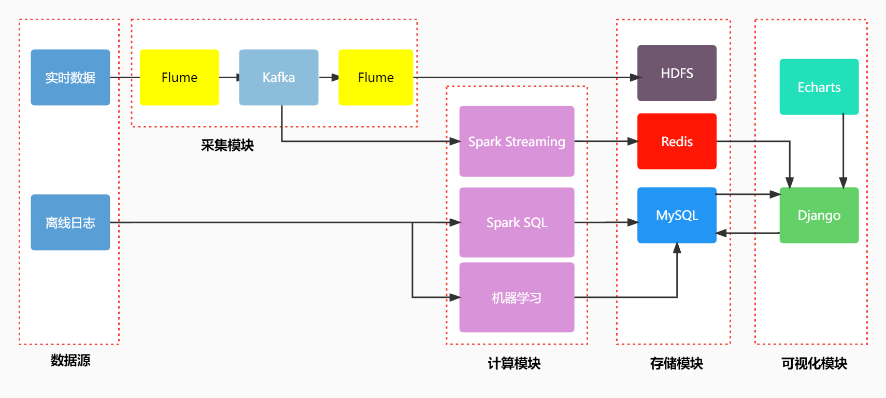

# Flume+Kafka+Spark搜索日志采集分析系统


## 项目介绍

该系统使用Flume将用户的实时搜索日志数据采集到Kafka，再使用Flume拉取Kafka将采集的源数据存储到HDFS，同时使用Spark Streaming消费Kafka进行计算分析，对于离线数据使用Spark SQL分析计算，以及使用机器学习等手段挖掘将计算结果存储MySQL，使用django进行web系统开发，使用Echarts对计算结果进行可视化展示。

```yacas
├─flume-conf       // Flume配置文件
├─simulate         // 日志模拟文件
├─ml-job		  // 机器学习代码
├─spark-job        // spark 实时计算代码和离线分析代码
├─sql			  // 数据库结构及数据sql文件
└─webapp		  // web服务
```


## 环境需求

| 需求配置项 | 配置信息     |
| ---------- | ------------ |
| 系统       | Ubuntu 16.04 |
| Hadoop     | 2.7.3        |
| Spark      | 2.3.3        |
| Flume      | 1.8.0        |
| Kafka      | 2.4.0        |
| Zookeeper  | 3.6.1        |
| Redis      | 5.0.1        |
| MySQL      | 8.0.21       |

## 整体设计



<font color="red">注：详细流程请见系统操作说明书及[演示视频](https://www.bilibili.com/video/BV15Y411N77c/?vd_source=eeb1b759fed37a9c9c11140fbcf766eb)</font>

## 数据来源

实时数据：python模拟抽取写入

离线数据：来源于搜狗实验室SogouQ完整数据集，该数据集包含200806一个月的数据，两千多万行数据

[数据集下载](http://www.sogou.com/labs/resource/q.php)

## 实时计算分析

### 日志模拟

模拟日志文件：`log_sogon_random.py`<font color="red">注：需要将搜狗精简版放在同一个文件夹下。</font>

### 动态采集

1、启动Hadoop   `start-all.sh`

2、启动zookeeper  `./zkServer.sh start`

3、启动Kafka  `./bin/kafka-server-start.sh config/server.properties`

​	 需要自己创建两个topic   weblog-spark-topic；weblog-sink-topic

​	`kafka-topics.sh --create --zookeeper localhost:2181 --replication-factor 1 --partitions 1 --topic weblog-spark-topic`

​	`kafka-topics.sg --create --zookeeper localhost:2181 --replication-factor 1 --partitions 1 --topic weblog-sink-topic`

​	 查看`kafka topic`：

​	

4、启动Flume ：分别启动A1和A3 ，A1负责监控文件，A3负责拉取kafka上传HDFS备份

​	`flume-ng agent --name a1 --conf $FLUME_HOME/conf --conf-file $FLUME_HOME/conf/file-kafka.conf -Dflume.root.logger=INFO, console`

​	`flume-ng agent --name a3 --conf $FLUME_HOME/conf --conf-file $FLUME_HOME/conf/kafka-hdfs.conf -Dflume.root.logger=INFO, console`

5、启动Redis

​	  windows：`redis-server.exe redis.windows.conf`

### 实时计算

1、启动spark streaming ：IDEA打开`StreamJob` 需要修改kafka的地址和端口
2、打包jar使用 `spark-submit`提交Job

## 离线分析

1、离线分析计算结果已经计算完成，导入`sql`打开系统即可查看

2、<font color="#ff0000">`如需自己运行`</font>：

​		Spark SQL指标分析代码：`MyJob` 里面也包含了sparksql清洗导出csv的代码，导出后需要整理到一个文件夹

​		机器学习代码：

​			LDA主题聚类代码：`lda_job.py` 需要修改文件路径

​			TextRank：`keywords_jieba.py` 需要修改文件路径

## 系统开发及可视化

1、导入`mysql`数据库 ，sql文件在目录中，数据库名为`dingke`

2、pycharm 打开 `webapp`  使用 ``python manager.py runserver`` 启动项目


